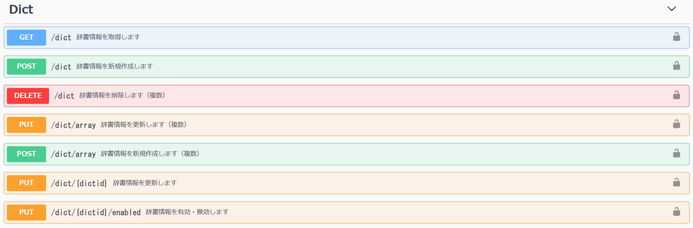
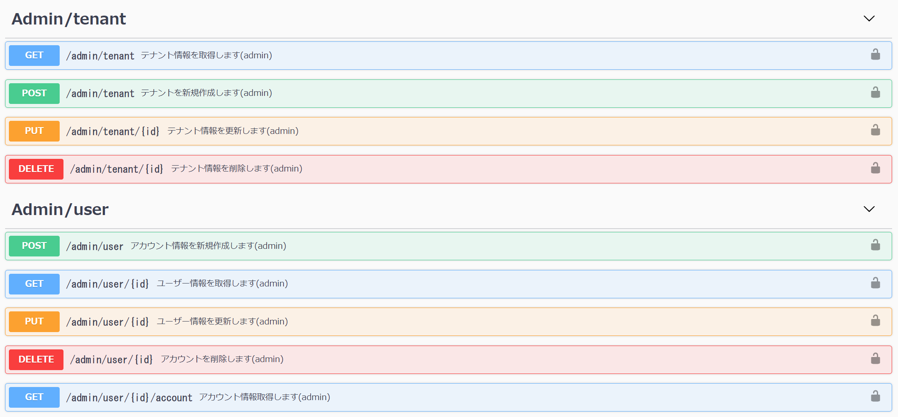

## API説明

1. /admin 管理者（システム）
1. /tenant 組織（管理者）
1. /user 個人・管理者
1. /dict 辞書類
1. /facility 施設（管理者）
1. /holidays 休日
1. /menu メニュー（管理者）
1. /schedule スケジュール（管理者）
1. /reserve 予約（個人・管理者）

 

## 実装済みAPI

| class | api path | method | memo |
| ---- | ---- | ---- | ---- |
| user | /user | GET | ログイン中ユーザー（自分）情報を取得します |
| | /user | PUT | ユーザー（自分）情報を更新します  {"name":"ユーザー","address":"住所"} |
| | /user/account | GET | ログイン中ユーザー（自分）ログイン情報を取得します |
| | /user/class/{id} | PUT | ユーザークラスを切り替えします 複数クラスに所属の場合、アクティブのクラスが１つしかありません。 |
| | /user/classes | GET | ユーザーのクラス一覧取得を取得します |
| | /user/confirm | GET | ユーザーEmailの確認 |
| | /user/login | POST | ログイン |
| | /user/logout | GET | ログアウト |
| | /user/password | PUT | パスワードを変更します |
| | /user/refresh | POST | リフレッシュトークン 新しいアクセストークンを発行します |
| | /user/tenants | GET | ユーザーの所属テナント一覧を取得します |
| | /user/tenants/{id} | PUT | ユーザーの所属テナントをアクティブします 複数テナントに所属の場合、アクティブのテナントが１つしかありません。 |
| dict | /dict | GET | 辞書情報を取得します |
| | /dict | POST | 辞書情報を新規作成します |
| | /dict | DELETE | 辞書情報を削除します |
| | /dict/array | PUT | 辞書情報を更新します（複数） |
| | /dict/array | POST | 辞書情報を新規作成します（複数） |
| | /dict/{dictid} | PUT | 辞書情報を更新します |
| | /dict/{dictid}/enabled | PUT | 辞書情報を有効・無効します |

---
- User  

- Tenant 

- Holidays

- Dict

- Admin
